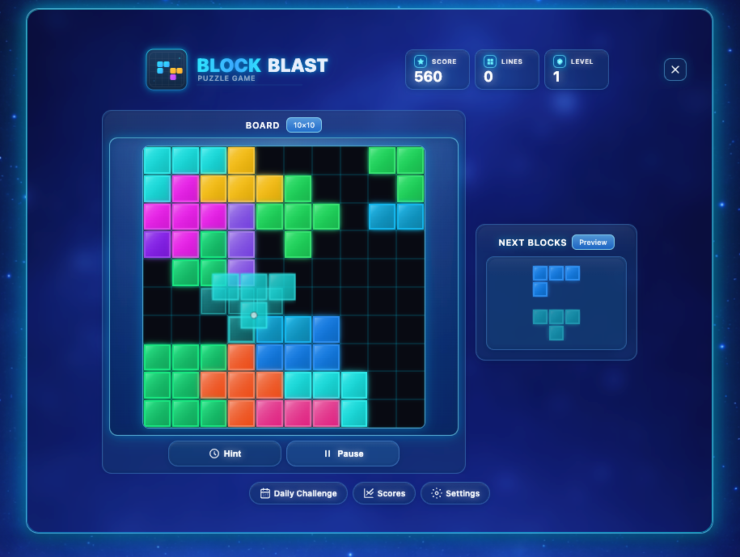

# Block Blast - Neon Glass Edition 🎮

A beautiful, modern block puzzle game with neon glass aesthetics and smooth animations. Built with vanilla JavaScript and Electron.



## Features ✨

- **Neon Glass UI** - Glassmorphic design with glowing effects and gel-style panels
- **Smooth Animations** - Fluid block placement and line-clearing animations
- **Drag & Drop Gameplay** - Intuitive drag-and-drop with visual feedback
- **Score System** - Track score, lines cleared, and level with stat cards
- **Scores Page** - Best scores and recent games history
- **Daily Challenge** - Today's goal with challenge history
- **Settings** - Audio (sound effects, music), visual options (animations, auto-save), difficulty, data management
- **Hint System** - Highlight valid placements when stuck
- **Fixed Layout** - Optimized layout that fits any screen

## How to Play 🎯

1. **Drag blocks** from the "Next Blocks" panel onto the 10×10 grid
2. **Complete rows or columns** to clear them and earn bonus points
3. **Plan ahead** - You can see the next 3 blocks coming
4. **Use hints** when needed - the Hint button shows valid placement positions
5. **Game over** when no more blocks can be placed

## Scoring 💯

- **Block Placement**: Points based on block size × level × 10
- **Line Clears**: Bonus points for each line cleared × level × 100
- **Level Up**: Every 10 lines cleared increases your level

## Controls 🎮

- **Mouse Drag**: Click and drag blocks to place them on the board
- **Hint Button**: Shows where the next block can be placed
- **Pause Button**: Pause/resume the game

## Tech Stack 🛠️

- **Vanilla JavaScript** (ES modules) - Modular game logic
- **HTML5 Canvas** - Board and block rendering
- **Modern CSS** - Glassmorphism, gradients, backdrop filters
- **Electron** - Desktop app (macOS, Windows)

## Installation & Running 🚀

### Option 1: Electron Desktop App (Recommended)

1. **Install dependencies:**
   ```bash
   npm install
   ```

2. **Run the app:**
   ```bash
   npm start
   ```

3. **Run in development mode (with DevTools):**
   ```bash
   npm run dev
   ```

4. **Build distributable apps:**
   ```bash
   npm run dist          # Build for current platform
   npm run dist:mac      # macOS (.zip)
   npm run zip:mac       # macOS zip
   npm run dist:win      # Windows portable (.exe)
   npm run portable:win  # Windows portable
   npm run unpacked      # Output unpacked app (no installer)
   ```

   Built apps will be in the `dist/` directory.

### Option 2: Direct Open (Web Browser)
Simply open `index.html` in your web browser.

### Option 3: Local Server (for browser)
```bash
# Python 3
python3 -m http.server 8000
# Visit http://localhost:8000

# Node.js
npx http-server
# Visit http://localhost:8080 (default)
```

## Project Structure 📁

```
block-blast-v2/
├── index.html              # Main HTML entry
├── main.js                 # Electron main process
├── preload.js              # Electron preload script
├── package.json            # Dependencies and build config
├── src/
│   ├── css/
│   │   └── style.css       # Styles and glass theme
│   └── js/
│       ├── main.js         # App entry, event wiring
│       ├── game.js         # Game loop, init, pause, restart
│       ├── board.js        # Board logic and placement
│       ├── shapes.js       # Shape definitions and preview rendering
│       ├── shapeUtils.js   # Shape utilities
│       ├── drag.js         # Drag-and-drop handling
│       ├── render.js       # Board rendering
│       ├── draw.js         # Canvas drawing helpers
│       ├── state.js        # Game state and callbacks
│       ├── config.js       # Board size, shape definitions
│       ├── storage.js      # Local storage, scores, settings
│       ├── pages.js        # Scores, Daily Challenge, Settings pages
│       └── utils.js        # Shared utilities
├── assets/
│   ├── icons/              # block-blast-logo.svg, block-blast-icon.svg, etc.
│   ├── background.png
│   ├── background-landscape.png
│   └── screenshot.png
├── build/                  # Electron app icons (optional)
├── .gitignore
└── README.md
```

## Browser Support 🌐

- Chrome/Edge 90+
- Firefox 88+
- Safari 14+
- Opera 76+

Requires support for:
- CSS `backdrop-filter`
- CSS `color-mix()`
- HTML5 Canvas
- ES6+ JavaScript

## Customization 🎨

### Colors
The game uses CSS variables in `:root` in `src/css/style.css`:
```css
:root {
  --glass-bg: rgba(6, 28, 65, 0.1);
  --glass-border: rgba(90, 220, 255, 0.7);
  --accent-cyan: #6ef5ff;
  --accent-blue: #4db5ff;
  --text-primary: #f6fbff;
  /* ... more glass/gel theme variables */
}
```

### Game Configuration
Modify constants in `src/js/config.js`:
```javascript
export const BOARD_SIZE = 10;         // Grid size (10×10)
export const PREVIEW_CELL_SIZE = 20;  // Preview block size
export const SHAPE_DEFINITIONS = [...]; // Tetris-style block shapes
```

## Building for Distribution 📦

The app uses `electron-builder` for creating distributable packages. Before building:

1. **Optional: Add app icons**
   - `build/icon.icns` - macOS
   - `icons/icon.ico` - Windows
   - `build/icon.png` (512×512) - Linux (if building for Linux)
   - Use `assets/icons/block-blast-icon.svg` as a source; convert to required formats
   - If icons are not provided, default Electron icons will be used

2. **Build commands:**
   ```bash
   npm run dist        # Build for current platform
   npm run dist:mac    # Build macOS app (.zip)
   npm run dist:win    # Build Windows portable (.exe)
   npm run portable:win # Windows portable
   npm run unpacked    # Unpacked app only
   ```

3. **Output:** Built applications will be in the `dist/` directory

## System Requirements 💻

- **Node.js** 16+ (for development)
- **npm** or **yarn** (for package management)
- **macOS 10.13+**, **Windows 10+**, or **Linux** (for running Electron app)

## License 📄

MIT © Vector

## Credits 🙏

Design inspired by modern glassmorphic UI trends and classic block puzzle games.

---

Enjoy the game! 🎮✨
